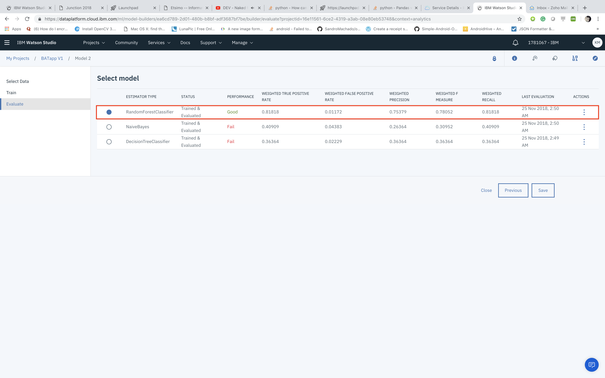

# BATapp

## Description:

- BATapp is a platform  where  technology businesses -  whether startups or SMEs - can get direct access to their partners or investors who  match directly with their interests and needs.

- We see that technology is disrupting our business landscape, and that big businesses need to collaborate more with startups to meet those challenges.

We're developing three machine learning models:

- Matching startups with corporations.
- Matching startups with investors.
- Predicting the probability of successes of the partnerships.
- Tracking the process

## Machine Learning Model Preformance

## Team

- Kunal Malhotra
- Rada Dahhane
- Anni Eerik
- Abhishek Gupta